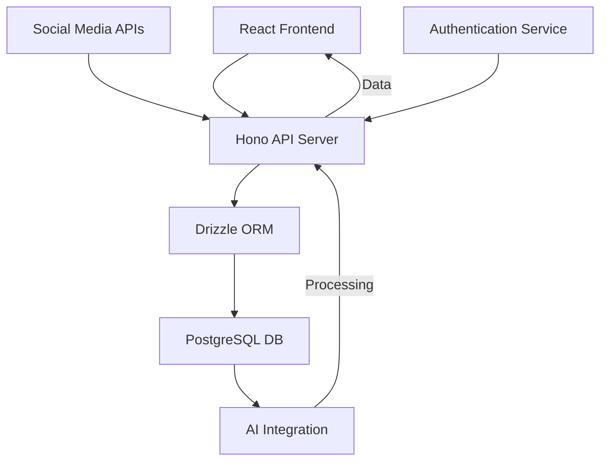

# RecCollection Technical Architecture

## System Architecture

### Overview

RecCollection follows a modern web application architecture with a clear separation between the frontend and backend components. The system uses a RESTful API approach with a React frontend and a Hono-based backend, connected to a PostgreSQL database.



### Frontend Architecture

- **Framework**: React with TypeScript
- **State Management**: React Router v7 loaders
- **Component Library**: shadcn/ui
- **Styling**: Tailwind CSS
- **Build Tool**: Bun
- **Example Component**: `app/frontend/src/components/recipe/RecipeForm.tsx`

### Backend Architecture

- **Framework**: Hono
- **Runtime**: Bun
- **API Style**: RESTful
- **Authentication**: JWT-based authentication
- **Database Access**: Drizzle ORM

### Database Architecture

- **Database**: PostgreSQL
- **ORM**: Drizzle
- **Main Entities**:
  - Users
  - Recipes
  - Ingredients
  - Instructions
  - Categories/Tags
  - Comments
  - Likes/Saves

## Data Model

### Entity Relationship Diagram

```
┌─────────┐       ┌─────────┐       ┌───────────┐
│  Users  │───┐   │ Recipes │───────│Ingredients│
└─────────┘   │   └─────────┘       └───────────┘
              │        │
              │        │            ┌───────────┐
              │        └────────────│Instructions│
              │                     └───────────┘
              │
┌─────────┐   │   ┌─────────┐
│ Comments│───┘   │Categories│
└─────────┘       └─────────┘
```

### Key Database Tables

1. **users**

   - id (PK)
   - username
   - email
   - password_hash
   - created_at
   - updated_at

2. **recipes**

   - id (PK)
   - user_id (FK)
   - title
   - description
   - cooking_time
   - serving_size
   - difficulty_level
   - image_url
   - created_at
   - updated_at

3. **ingredients**

   - id (PK)
   - recipe_id (FK)
   - name
   - quantity
   - unit
   - order

4. **instructions**

   - id (PK)
   - recipe_id (FK)
   - step_number
   - description

5. **categories**

   - id (PK)
   - name

6. **recipe_categories**

   - recipe_id (FK)
   - category_id (FK)

7. **comments**

   - id (PK)
   - recipe_id (FK)
   - user_id (FK)
   - content
   - created_at

8. **likes**
   - user_id (FK)
   - recipe_id (FK)
   - created_at

## API Endpoints

### User Management

- `POST /api/auth/register` - Register a new user
- `POST /api/auth/login` - User login
- `GET /api/auth/me` - Get current user
- `PUT /api/users/:id` - Update user profile

### Recipe Management

- `GET /api/recipes` - List recipes
- `GET /api/recipes/:id` - Get recipe details
- `POST /api/recipes` - Create a recipe
- `PUT /api/recipes/:id` - Update a recipe
- `DELETE /api/recipes/:id` - Delete a recipe

### Recipe Import

- `POST /api/import/instagram` - Import from Instagram
- `POST /api/import/tiktok` - Import from TikTok

### Social Features

- `POST /api/recipes/:id/like` - Like a recipe
- `DELETE /api/recipes/:id/like` - Unlike a recipe
- `POST /api/recipes/:id/comments` - Comment on a recipe
- `GET /api/recipes/:id/comments` - Get recipe comments

### AI Integration

- `POST /api/ai/generate-name` - Generate recipe name
- `POST /api/ai/generate-description` - Generate recipe description

## External Integrations

### Social Media APIs

- Instagram API for post imports
- TikTok API for video imports

### AI Services

- OpenAI API for text generation
- Custom AI models for recipe analysis
