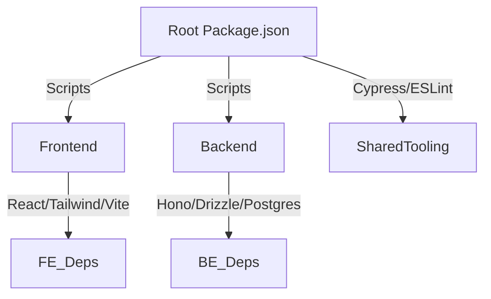

# Architectural Analysis: Package Structure

## Current Findings:

1. **Root package.json** acts as script coordinator without workspace configuration
2. **Frontend/Backend** have completely independent dependency trees
3. Shared tooling (Cypress/ESLint) exists at root level but isn't leveraged by subprojects
4. No shared TypeScript config or linting rules across projects



## Recommended Monorepo Conversion Plan:

1. Add workspace configuration to root package.json:

```json
"workspaces": [
  "app/frontend",
  "app/backend",
  "packages/*"
]
```

2. Create shared packages directory for:
   - ESLint/TypeScript configs
   - UI component library
   - Database schema definitions
3. Consolidate duplicated devDependencies:
   - TypeScript
   - Testing frameworks
   - Linting tools
4. Implement turborepo for task orchestration

## Next Steps:

1. Initialize proper monorepo structure
2. Migrate shared dependencies to root
3. Set up cross-project task pipelines
