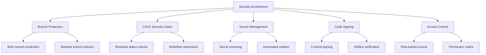

# GitHub Repository Security Architecture

## Core Components



## Implementation Details

### Branch Protection Rules (`.github/branch-protection.yml`)

```yaml
rules:
  - pattern: "main"
    required_approvals: 2
    required_status_checks:
      - build
      - test
      - security-scan
    linear_history: true
    signature_requirement: vigilant
```

### Team Permissions Matrix (`.github/teams.yml`)

```yaml
roles:
  admin:
    permissions:
      - repo: write
      - secrets: write
      - workflows: write

  maintainer:
    permissions:
      - repo: triage
      - secrets: read
      - workflows: read

  contributor:
    permissions:
      - repo: read
      - issues: write
      - pull_requests: write
```

### Code Signing Configuration (`.gitconfig.signing`)

```ini
[commit]
    gpgsign = true
[gpg]
    program = /usr/bin/gpg
[tag]
    forceSignAnnotated = true
```

## Related Documents

- [Security Considerations](../docs/security_considerations.md)
- [CI/CD Pipeline Documentation](../docs/deployment_strategy.md)
